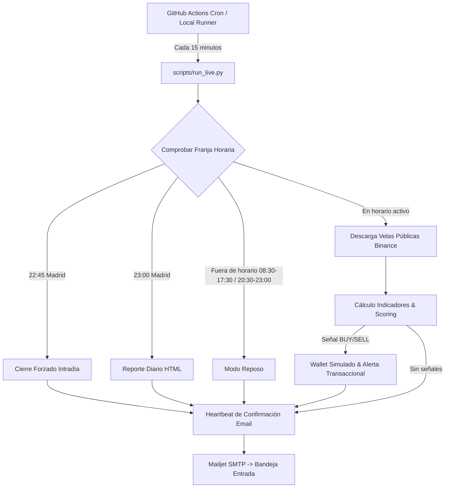

# 🚀 TradIA — Sistema de Señales y Simulación de Day-Trading

TradIA es un motor algorítmico y determinista de señales de day-trading para criptomonedas (BTC/USDT, ETH/USDT) con modo **Paper Trading** (simulación con balance virtual de 10.0€ y colchón dinámico protegido de 6.0€).

Funciona **sin credenciales de exchange ni riesgo de fondos reales** (utiliza exclusivamente endpoints públicos de solo lectura de Binance).

---

## 🏗️ Arquitectura de Ejecución



---

## ⚠️ PERSISTENCIA: Entorno Local vs Producción Cloud

TradIA implementa un **gestor híbrido de base de datos** (`src/database/db.py`) que selecciona dinámicamente el backend según las variables de entorno detectadas:

### 1. Entorno LOCAL (Desarrollo y Tests)
> [!IMPORTANT]
> **NO incluyas `SUPABASE_URL` ni `SUPABASE_KEY` en tu archivo `.env` local.**  
> Al dejarlas vacías o comentadas, TradIA selecciona automáticamente **SQLite local** (`data/tradia.db`).  
> Esto garantiza que cualquier prueba, backtest o suite de tests unitarios se ejecute en un entorno 100% aislado, sin riesgo de machacar, borrar o alterar los datos de producción en Supabase.

### 2. Entorno PRODUCCIÓN (GitHub Actions en la Nube)
En GitHub Actions, el workflow inyecta `SUPABASE_URL` y `SUPABASE_KEY` desde los **Repository Secrets**. TradIA detecta estas credenciales y opera automáticamente sobre la base de datos PostgreSQL en la nube de Supabase.

---

## 💓 Confirmaciones de Ciclo (Heartbeat Emails)

Para tener total certeza de que el sistema se está ejecutando las 24 horas del día cada 15 minutos, TradIA incluye un sistema de **Heartbeat**:

- **Dentro de horario activo (sin señales):**  
  `✅ TradIA — Ciclo OK [hora]. Sin señales. Balance: 10.00€`
- **Fuera de horario activo (madrugada / descanso):**  
  `✅ TradIA — Ciclo OK [hora]. Fuera de horario, en reposo. Balance: 10.00€`
- **Alerta de error ante excepciones no controladas:**  
  `❌ TradIA — Error en ciclo [hora]: [detalle de excepción]` (nunca hay fallos silenciosos).

### ⚙️ Configuración y Control del Heartbeat
El envío de estos correos se controla desde `config/config.yaml`:
```yaml
notifications:
  channel: "email"
  heartbeat_emails: true   # true para activar; false para desactivar
```
O mediante variable de entorno:
```bash
HEARTBEAT_EMAILS=false
```

> [!WARNING]
> **Aviso de Volumen de Correo:**  
> Una ejecución cada 15 minutos genera **96 emails en 24 horas** (~32 emails durante la noche).  
> Se recomienda dejar `heartbeat_emails: true` durante la primera noche de validación para certificar que el cron de GitHub Actions funciona de manera ininterrumpida. Posteriormente, se recomienda cambiar a `heartbeat_emails: false` para recibir únicamente las alertas transaccionales (compras, ventas, cierre 22:45 y reporte diario 23:00).

---

## 🔐 Configuración de Secrets en GitHub Actions

Para que el bot funcione de forma autónoma en la nube, configura los siguientes **Secrets** en tu repositorio de GitHub (**Settings** → **Secrets and variables** → **Actions**):

| Secret | Descripción | Ejemplo |
| :--- | :--- | :--- |
| `SUPABASE_URL` | URL de tu proyecto en Supabase | `https://xyzproject.supabase.co` |
| `SUPABASE_KEY` | `service_role` (o `anon`) key de Supabase | `eyJhbGciOi...` |
| `MAILJET_API_KEY` | API Key pública de Mailjet | `1d5a47688a8ac1...` |
| `MAILJET_SECRET_KEY` | Secret Key privada de Mailjet | `7969c7fa36...` |
| `MAILJET_SENDER` | Remitente verificado en Mailjet | `tu_correo@gmail.com` |
| `MAILJET_TO` | Destinatario que recibirá los emails | `tu_correo@gmail.com` |

---

## 🛠️ Comandos de Uso

### Ejecutar un ciclo localmente (modo prueba puntual)
```bash
python scripts/run_live.py
```

### Ejecutar en modo demonio continuo (APScheduler local)
```bash
python scripts/run_live.py --loop
```

### Reiniciar el wallet ficticio a 10.00€
```bash
python scripts/run_live.py --reset-wallet
```

### Ejecutar suite completa de tests unitarios e integración
```bash
python -m unittest discover tests
```

### Migrar histórico de SQLite local a Supabase
```bash
python scripts/migrate_sqlite_to_supabase.py
```

---

## 🌐 Dashboard Web de Control & Métricas (GitHub Pages)

TradIA incluye un panel web estático profesional ubicado en la carpeta `docs/`, listo para ser servido gratuitamente mediante **GitHub Pages** y conectado directamente a Supabase:

### Características:
- **Seguridad Supabase Auth:** Inicio de sesión delegado (Email + Contraseña). Los datos están protegidos por Row Level Security (RLS) en PostgreSQL, permitiendo lectura y escritura únicamente a usuarios autenticados.
- **Control Remoto del Bot (`bot_control`):**
  - Botones para **Encender / Reanudar**, **Pausa Temporal** (1h, 2h, 4h, 8h, 24h, 7d o fecha personalizada) y **Pausa Indefinida**.
  - Editor en vivo de franjas horarias de trading (Madrid) sin necesidad de modificar archivos YAML ni hacer commits.
- **Métricas de Rendimiento (KPIs):** Ganancia/pérdida en la última 1h, últimas 24h, última semana y balance total de la cartera.
- **Gráfica de Curva de Capital (Chart.js):** Evolución visual del balance acumulado trade a trade.
- **Historial Completo de Operaciones:** Tabla detallada de compras y ventas con precios, importes, P&L neto (€ y %) y motivos técnicos.
- **Informes Diarios:** Tabla de instantáneas de fin de jornada (Win Rate %, número de operaciones, etc.).

### Despliegue en GitHub Pages:
1. En tu repositorio de GitHub, entra en **Settings** → **Pages**.
2. En **Build and deployment** → **Branch**, selecciona `main` (o tu rama principal) y en la carpeta elige **/docs**.
3. Pulsa **Save**. En 1 minuto tendrás tu dashboard disponible en `https://<tu-usuario>.github.io/<tu-repo>/`.

### Configuración del Usuario en Supabase:
1. En tu panel de Supabase, ve a **Authentication** → **Users** → **Add user** → **Create user**.
2. Introduce tu email y la contraseña que desees para acceder al dashboard.
3. En el SQL Editor de Supabase, ejecuta el contenido actualizado de `supabase_schema.sql` para crear la tabla `bot_control` y activar las políticas RLS.
